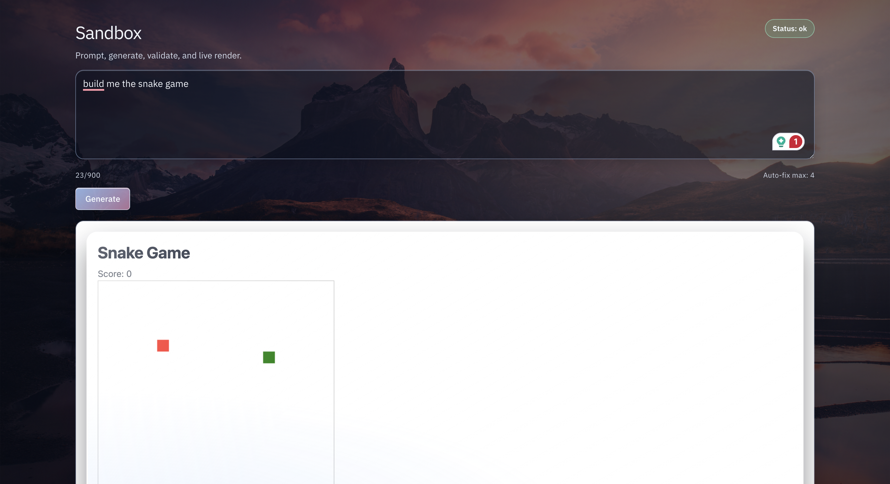

# Adapt UI
Demo: https://adapt-ui.vercel.app/

Adapt UI is a prompt-to-app sandbox that generates React components and mini-games, validates them, renders them in an isolated iframe, and auto-repairs when errors occur.

## Screenshots

### Landing Page

### Sandbox

